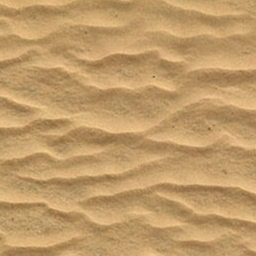

# ImageQuilting. py

This is unofficial Python implementation of *[Image Quilting for texture synthesis and transfer [Efros & Freeman, 2001]](https://people.eecs.berkeley.edu/~efros/research/quilting.html)* for my practice.

It loads images in `tex/` as inputs, and outputs will be rendered in `result/`.

Currently only texture synthesis is implemented. (style transfer is yet)

# Results

Sample textures are from textures.com.

## Input 
(256 * 256) 

## Output 
(1024 * 1024) 

Minimum error lines:

---
## Input 
(256 * 256)

## Output 

(1024 * 1024)

Minimum error lines:

